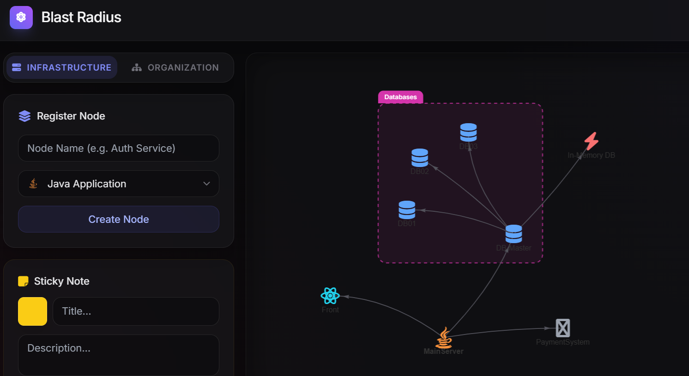

# ⚛️ Architecture Blast Radius Analyzer

A full-stack visualization and analysis tool designed to map microservice ecosystems, track team ownership, and calculate the "blast radius" (impact zone) of potential service failures using Graph Data modeling.

 **

## 🚀 Features

* **Interactive Topology Mapping:** Visually construct your system architecture. Add microservices, databases, and caches (Java, Go, Node.js, PostgreSQL, Redis, etc.) with custom icon sets.
* **Blast Radius Algorithm:** Instantly calculate and highlight downstream dependencies. If a core service goes down, the tool traverses the graph to show exactly which upstream services will be affected.
* **Organizational Mapping:** Register teams, add engineers, and assign microservices to specific maintainer teams to clarify ownership.
* **Clustering & Context:** Group related microservices into colored deployment clusters. Attach floating or node-specific "Sticky Notes" for architectural documentation.
* **Dynamic Graph UI:** Smooth, physics-based graph rendering built with Vis.js, featuring interactive "drag-to-link" connection modes and dynamic action panels.

## 🛠️ Tech Stack

**Backend:**
* Java 17
* Spring Boot 3 (Web, RESTful APIs)
* Spring Data Neo4j
* Neo4j Driver (Cypher Query Language)

**Frontend:**
* HTML5 / CSS3
* Vanilla JavaScript
* Tailwind CSS (for modern, glassmorphism UI)
* Vis.js Network (for physics-based graph rendering)
* FontAwesome 6

## ⚙️ Getting Started

### Prerequisites
* Java 17+
* Maven
* A running instance of **Neo4j** (Local or Neo4j AuraDB)

### Configuration
1. Clone the repository:
   ```bash
   git clone [https://github.com/mshupliakou/blast-radius-analyzer.git](https://github.com/mshupliakou/blast-radius-analyzer.git)
   ```

2. Configure your Neo4j database credentials in `src/main/resources/application.properties`:

    ```properties
    spring.application.name=BlastRadiusAnalyzer
    NEO4J_URI=bolt://localhost:7687
    NEO4J_USERNAME=neo4j
    NEO4J_PASSWORD=your_password
    NEO4J_DATABASE=neo4j
    ```
3. Running the Application
Run the Spring Boot application using Maven:

    ```bash
    ./mvnw spring-boot:run
    ```
4. The application will be available at http://localhost:8080.

### 🧠 How it Works (Cypher Example)
The blast radius calculation leverages Neo4j's powerful graph traversal. When analyzing a target service, the backend executes a Cypher query to find all paths of DEPENDS_ON relationships leading to the target of any depth (*1..):

```
MATCH (m:Microservice)-[:DEPENDS_ON*1..]->(target {id: $targetId})
RETURN DISTINCT m.id AS id, m.name AS name, m.language AS language
```